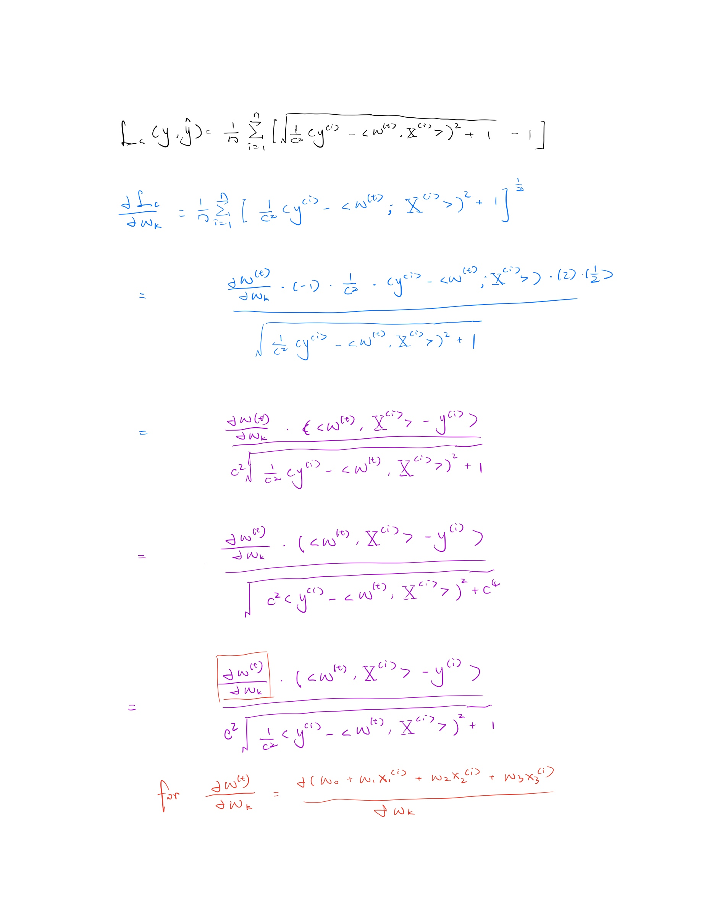
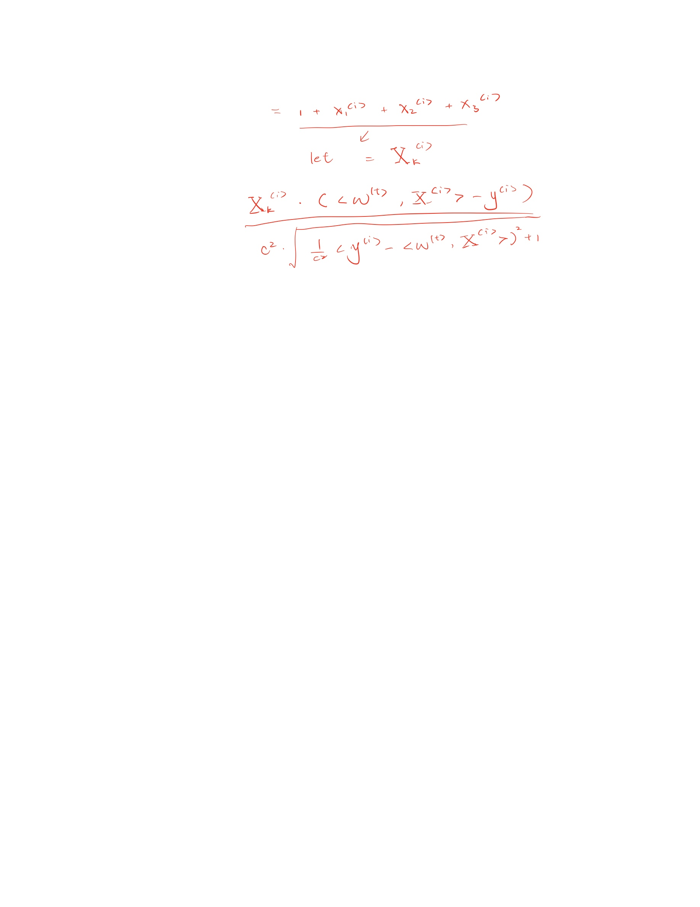
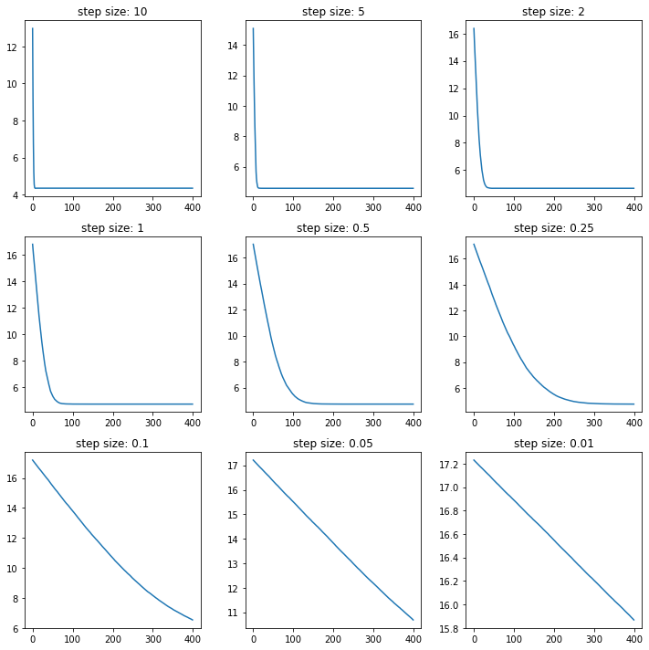
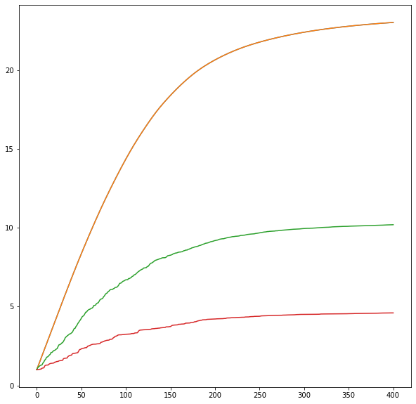
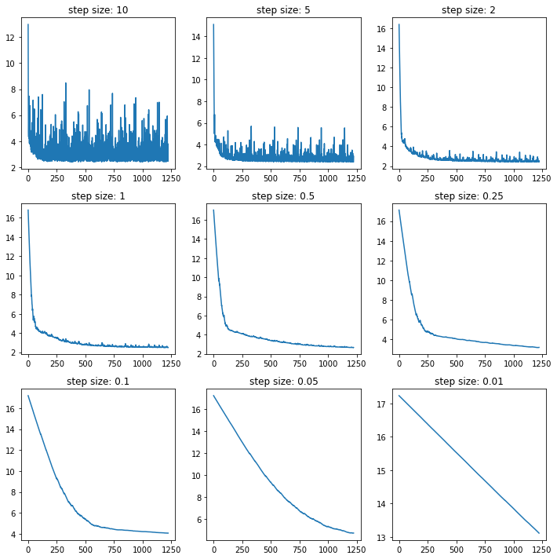
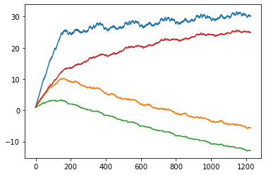

# Homework 1: Gradient Descent & Friends


```python
import pandas as pd
import numpy as np
import matplotlib.pyplot as plt

df = pd.read_csv("./real_estate.csv")
np.set_printoptions(suppress=True)
```

## Question 1 (Pre-processing)

### (a) Remove any rows of the data that contain a missing (‘NA’) value. List the indices of the removed data points. Then, delete all features from the dataset apart from: age, nearestMRT and nConvenience.


```python
null_index = df[df.isnull().any(axis=1) == True].index
df.dropna(axis=0, inplace=True)
prices = df['price']
df.drop(columns=['transactiondate', 'latitude', 'longitude', 'price'], inplace=True)
# print(null_index)
# print(df.head)
print("null indices: " , null_index.values)
```

    null indices:  [ 19  41 109 144 230 301]


### (b) normalisation and provide the mean value over your dataset


```python
def pre_processing(x_data):
    x_max = x_data.max()
    x_min = x_data.min()
    for _ in range(x_data.size):
        _temp = (x_data[_] - x_min) / (x_max - x_min)
        x_data[_] = _temp
    return x_data

x_new_age = pre_processing(np.array(df['age']))
x_new_mrt = pre_processing(np.array(df['nearestMRT']))
x_new_nCon = pre_processing(np.array(df['nConvenience']))

x_new_age_mean = x_new_age.mean()
x_new_mrt_mean = x_new_mrt.mean()
x_new_nCon_mean = x_new_nCon.mean()

print("x_new_age_mean: ", x_new_age_mean)
print("x_new_nearestMRT_mean: ", x_new_mrt_mean)
print("x_new_nConvenience_mean: ", x_new_nCon_mean)
```

    x_new_age_mean:  0.40607932670785213
    x_new_nearestMRT_mean:  0.16264267697310722
    x_new_nConvenience_mean:  0.4120098039215686


## Question 2 (Train and Test sets)

### first half of observations to create trainning set, remaining half for test set


```python
x_new = pd.DataFrame(columns=['age', 'nearestMRT', 'nConvenience'])
x_new['age'] = x_new_age
x_new['nearestMRT'] = x_new_mrt
x_new['nConvenience'] = x_new_nCon
size = x_new.index.size
training_price = prices.values[:int(size / 2)]
test_price = prices.values[int(size / 2):]
training_set = x_new.values[:int(size / 2)]
test_set = x_new.values[int(size / 2):]
```

### Print out the first and last rows of both your training and test sets


```python
x_print = pd.DataFrame(columns=['age', 'nearestMRT', 'nConvenience', 'price'])
x_print['age'] = x_new_age
x_print['nearestMRT'] = x_new_mrt
x_print['nConvenience'] = x_new_nCon
x_print['price'] = prices.values

training_print = x_print.values[:int(size / 2)]
test_print = x_print.values[int(size / 2):]

first_training_row = training_print[0]
last_training_row = training_print[-1]
first_test_row = test_print[0]
last_test_row = test_print[-1]

print("first training row: ", first_training_row)
print("last training row: ", last_training_row)
print("first test row: ", first_test_row)
print("last test row: ", last_test_row)
```

    first training row:  [ 0.73059361  0.00951267  1.         37.9       ]
    last training row:  [ 0.87899543  0.09926012  0.3        34.2       ]
    first test row:  [ 0.26255708  0.20677973  0.1        26.2       ]
    last test row:  [ 0.14840183  0.0103754   0.9        63.9       ]


## Question 3(Loss Function)




## Question 4 (Gradient Descent Psuedocode)

### gradient descent updates

```python
for i <- 0 to nIteration:
    derivate_sum <- 0
    for j <- 0 to tranning_set_size:
        derivate_sum += loss_function_derivate
    derivate_loss_mean <- derivate_sum / tranning_set_size
    
    w <- w - learning_rate * derivate_loss_mean
```

### stochastic gradient descent updates

### stochastic gradient descent updates

```python
for i <- 0 to nIteration:
    for epoch <- 0 to epoch_times:
        w = w - learning_rate * loss_function_derivate
```

## Question 5 (Gradient Descent Implementation)

### helper function


```python
def gradient_update(_X_k_i, w_t, training_values, prices_values, _size):
    _sum_gd = 0
    for _i in range(_size):
        wX = np.dot(w_t, training_values[_i])
        _sum_gd += ((_X_k_i * (wX - prices_values[_i])) / (2 * np.sqrt((wX - prices_values[_i]) ** 2 + 1)))
    return _sum_gd / _size


def loss_achieved(w_t, training_values, prices_values, _size, hyper):
    _sum_loss = 0
    for _i in range(_size):
        wX = np.dot(w_t.T, training_values[_i])
        _sum_loss += (np.sqrt(1 / (hyper ** 2) * (prices_values[_i] - wX) ** 2 + 1) - 1)
    return _sum_loss / _size
```

### (a) Generate a 3×3 grid of plots showing performance for each step-size.


```python
fig, ax = plt.subplots(3, 3, figsize=(10, 10))
nIter = 400
alphas = [10, 5, 2, 1, 0.5, 0.25, 0.1, 0.05, 0.01]
losses = []
training_size = training_set.shape[0]
training_gd_set = np.insert(training_set, 0, 1, axis=1)
c = 2
loss = []
w_plot = []
for i, ax in enumerate(ax.flat):
    w = np.ones(4)
    for index in range(nIter):
        temp = index
        if temp >= training_size:
            temp -= training_size
        w = w - gradient_update(training_gd_set[temp], w, training_gd_set, training_price, training_size) * alphas[i]
        loss_mean = loss_achieved(w, training_gd_set, training_price, training_size, c)
        loss.append(loss_mean)
    losses.append(loss)
    ax.plot(losses[i])
    loss.clear()
    ax.set_title(f"step size: {alphas[i]}")

plt.tight_layout()
plt.show()
```


    

    


### (b) choose an appropriate step size (and state your choice), and explain why you made this choice.

I will choose **step size = 0.5**, for `0.1`, it is more stable and it does not fast to get the lowest loss.

### (c) plot the progression of each of the four weights over the iterations, run your model on the train and test set, and print the achieved losses.


```python
w_plot.clear()
fig, ax = plt.subplots(figsize=(10, 10))
w = np.ones(4)
w_plot.append(w)
for index in range(nIter):
    temp = index
    if temp >= training_size:
        temp -= training_size
    Xki = np.array([1, training_gd_set[temp][0], training_gd_set[temp][1], training_gd_set[temp][2]])
    w = w - gradient_update(Xki, w, training_gd_set, training_price, training_size) * 0.3
    w_plot.append(w)
ax.plot(w_plot)
plt.show()

print("w0: ", w[0])
print("w1: ", w[1])
print("w2: ", w[2])
print("w3: ", w[3])

test_size = test_set.shape[0]
test_set_gd_set = np.insert(test_set, 0, 1, axis=1)
test_loss = loss_achieved(w, test_set_gd_set, test_price, test_size, c)
train_loss = loss_achieved(w, training_gd_set, training_price, training_size, c)
print("batch training loss: ", train_loss)
print("batch test_loss: ", test_loss)
```


    

    


    w0:  23.022722678965167
    w1:  23.022722678965167
    w2:  10.192369050047924
    w3:  4.597963020259536
    batch training loss:  6.097840919924557
    batch test_loss:  5.516429121702068


## Question 6

### (a) plot Stochastic Gradient Descent Implementation


```python
fig, ax = plt.subplots(3, 3, figsize=(10, 10))
losses.clear()
loss.clear()
epoch_times = 6
for i, ax in enumerate(ax.flat):
    w = np.ones(4)
    for _ in range(epoch_times):
        for index in range(training_size):
            # Xki = np.array([1, training_gd_set[index][0], training_gd_set[index][1], training_gd_set[index][2]])
            Xki = np.array(training_gd_set[index])
            wX = np.dot(w, training_gd_set[index].T)
            derivative_loss = (wX - training_price[index]) / (2 * np.sqrt((wX - training_price[index]) ** 2 + 4))
            w = w - alphas[i] * derivative_loss * Xki
            loss_mean = loss_achieved(w, training_gd_set, training_price, training_size, c)
            loss.append(loss_mean)

    losses.append(loss)
    ax.plot(losses[i])
    loss.clear()
    ax.set_title(f"step size: {alphas[i]}")

plt.tight_layout()
plt.show()
```


    

    


### (b) choose an appropriate step size, explain why

I will choose **step size = 0.25**, it is more stable and it can achieve lower loss.

### (c) plot the progression of each of the four weights over the iterations, run your model on the train and test set, and record the achieved losses.


```python
helper = []
w = np.ones(4)
helper.append(w)
for _ in range(epoch_times):
    for index in range(training_size):
        Xki = np.array(training_gd_set[index])
        wX = np.dot(w, training_gd_set[index].T)
        derivative_loss = (wX - training_price[index]) / (2 * np.sqrt((wX - training_price[index]) ** 2 + 4))
        w = w - 0.4 * derivative_loss * Xki
        helper.append(w)

plt.plot(helper)
plt.show()

print("w0: ", w[0])
print("w1: ", w[1])
print("w2: ", w[2])
print("w3: ", w[3])

test_loss = loss_achieved(w, test_set_gd_set, test_price, test_size, c)
train_loss = loss_achieved(w, training_gd_set, training_price, training_size, c)
print("SGD train_loss: ", train_loss)
print("SGD test_loss: ", test_loss)
```


    

    


    w0:  30.13206315742824
    w1:  -5.58368145074438
    w2:  -12.859753310061155
    w3:  24.875357185884425
    SGD train_loss:  2.780238696600798
    SGD test_loss:  2.8448220512160347


## Question7. Results Analysis

By adjusting different learning rate, we can get more stable and lower loss model. If we use a big learning rate, 
we may get a poor loss, however if we use a small learning rate, we need take more time to wait it to get the good loss.

Since GD need to get all sum and get the mean, it takes lots of time, however, sgd fix this problem.

SGD will frequently update gradient with a high varience causing fluctuation, therefore, GD has a smoother loss path than SGD.
