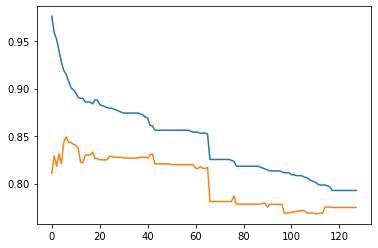

# Question1


```python
import time
from sklearn.svm import SVC
from sklearn.linear_model import LogisticRegression
from sklearn.ensemble import AdaBoostClassifier
from sklearn.ensemble import RandomForestClassifier
from sklearn.tree import DecisionTreeClassifier
from sklearn.neural_network import MLPClassifier
from sklearn.model_selection import train_test_split
from sklearn.preprocessing import StandardScaler
from sklearn.datasets import make_classification
```


```python
import numpy as np
import matplotlib.pyplot as plt
from matplotlib.colors import ListedColormap
import warnings

warnings.simplefilter(action='ignore', category=FutureWarning)
warnings.filterwarnings("ignore")
```


```python
def create_dataset(n=1250, nf=2, nr=0, ni=2, random_state=125):
    '''
    generate a new dataset with
    n: total number of samples
    nf: number of features
    nr: number of redundant features (these are linear combinatins of informative features)
    ni: number of informative features (ni + nr = nf must hold)
    random_state: set for reproducibility
    '''
    X, y = make_classification(n_samples=n,
                               n_features=nf,
                               n_redundant=nr,
                               n_informative=ni,
                               random_state=random_state,
                               n_clusters_per_class=2)
    rng = np.random.RandomState(2)
    X += 3 * rng.uniform(size=X.shape)
    X = StandardScaler().fit_transform(X)
    return X, y
```


```python
def plotter(classifier, X, X_test, y_test, title, ax=None):
    # plot decision boundary for given classifier
    plot_step = 0.02
    x_min, x_max = X[:, 0].min() - 1, X[:, 0].max() + 1
    y_min, y_max = X[:, 1].min() - 1, X[:, 1].max() + 1
    xx, yy = np.meshgrid(np.arange(x_min, x_max, plot_step),
                         np.arange(y_min, y_max, plot_step))
    Z = classifier.predict(np.c_[xx.ravel(), yy.ravel()])
    Z = Z.reshape(xx.shape)
    if ax:
        ax.contourf(xx, yy, Z, cmap=plt.cm.Paired)
        ax.scatter(X_test[:, 0], X_test[:, 1], c=y_test)
        ax.set_title(title)
    else:
        plt.contourf(xx, yy, Z, cmap=plt.cm.Paired)
        plt.scatter(X_test[:, 0], X_test[:, 1], c=y_test)
        plt.title(title)
```

## (a)


```python
# data set
data, target = create_dataset()

# split
X_train, X_test, Y_train, Y_test = train_test_split(data, target, train_size=0.5, test_size=0.5, random_state=15)

# classifier
classified_list = []

SVCModel = SVC()
SVCModel.fit(X_train, Y_train)
classified_list.append(SVCModel)

LogisticRegressionModel = LogisticRegression()
LogisticRegressionModel.fit(X_train, Y_train)
classified_list.append(LogisticRegressionModel)

AdaBoostClassifierModel = AdaBoostClassifier()
AdaBoostClassifierModel.fit(X_train, Y_train)
classified_list.append(AdaBoostClassifierModel)

RandomForestClassifierModel = RandomForestClassifier()
RandomForestClassifierModel.fit(X_train, Y_train)
classified_list.append(RandomForestClassifierModel)

DecisionTreeClassifierModel = DecisionTreeClassifier()
DecisionTreeClassifierModel.fit(X_train, Y_train)
classified_list.append(DecisionTreeClassifierModel)

MLPClassifierModel = MLPClassifier()
MLPClassifierModel.fit(X_train, Y_train)
classified_list.append(MLPClassifierModel)

classified_name_list = ['SVC', 'LogisticRegression', 'AdaBoostClassifier', 'RandomForestClassifier',
                        'DecisionTreeClassifier', 'MLPClassifier']

fig, ax = plt.subplots(3, 2, figsize=(10, 10))
for i, ax in enumerate(ax.flat):
    plotter(classifier=classified_list[i], X=X_train, X_test=X_test, y_test=Y_test, title=classified_name_list[i],
            ax=ax)
plt.tight_layout()
plt.show()
```


    

    


## (b)


```python
# data set
data, target = create_dataset()

X_train, X_test, Y_train, Y_test = train_test_split(data, target, train_size=0.8, test_size=0.2, random_state=45)
x_y_set = np.hstack((X_train, Y_train.reshape(1000, 1)))

size_list = [50, 100, 200, 300, 400, 500, 600, 700, 800, 900, 1000]

# np.random.shuffle(x_y_set)

# Decision Tree
DecisionTreeClassifierModel = DecisionTreeClassifier()
decision_tree_list = []
for i in range(len(size_list)):
    np.random.shuffle(x_y_set)
    DecisionTreeClassifierModel.fit(x_y_set[:size_list[i], :2], x_y_set[:size_list[i], 2])
    decision_tree_list.append(DecisionTreeClassifierModel.score(X_test, Y_test))

# Random Forest
RandomForestClassifierModel = RandomForestClassifier()
random_forest_list = []
for i in range(len(size_list)):
    np.random.shuffle(x_y_set)
    RandomForestClassifierModel.fit(x_y_set[:size_list[i], :2], x_y_set[:size_list[i], 2])
    random_forest_list.append(RandomForestClassifierModel.score(X_test, Y_test))

# AdaBoost
AdaBoostClassifierModel = AdaBoostClassifier()
ada_boost_list = []
for i in range(len(size_list)):
    np.random.shuffle(x_y_set)
    AdaBoostClassifierModel.fit(x_y_set[:size_list[i], :2], x_y_set[:size_list[i], 2])
    ada_boost_list.append(AdaBoostClassifierModel.score(X_test, Y_test))

# LogisticRegression
LogisticRegressionModel = LogisticRegression()
logistic_regression_list = []
for i in range(len(size_list)):
    np.random.shuffle(x_y_set)
    LogisticRegressionModel.fit(x_y_set[:size_list[i], :2], x_y_set[:size_list[i], 2])
    logistic_regression_list.append(LogisticRegressionModel.score(X_test, Y_test))

# MLPClassifier
MLPClassifierModel = MLPClassifier()
neural_network_list = []
for i in range(len(size_list)):
    np.random.shuffle(x_y_set)
    MLPClassifierModel.fit(x_y_set[:size_list[i], :2], x_y_set[:size_list[i], 2])
    neural_network_list.append(MLPClassifierModel.score(X_train, Y_train))

# SVC
SVCModel = SVC()
svc_list = []
for i in range(len(size_list)):
    # np.random.shuffle(x_y_set)
    SVCModel.fit(x_y_set[:size_list[i], :2], x_y_set[:size_list[i], 2])
    svc_list.append(SVCModel.score(X_test, Y_test))

plt.plot(size_list, decision_tree_list, label='Decision Tree')
plt.plot(size_list, random_forest_list, label='Random Forest')
plt.plot(size_list, ada_boost_list, label='AdaBoost')
plt.plot(size_list, logistic_regression_list, label='Logistic Regression')
plt.plot(size_list, neural_network_list, label='Neural Network')
plt.plot(size_list, svc_list, label='SVM')
plt.legend()
plt.show()
```


    

    


From the graph, i will choose Logistic Regression model because it has higher accuracy and more stable than others.

## (c)


```python
# data set
data, target = create_dataset()

# split
# X_train, X_test = train_test_split(data, train_size=0.8, test_size=0.2, random_state=45)
# Y_train, Y_test = train_test_split(target, train_size=0.8, test_size=0.2, random_state=45)

X_train, X_test, Y_train, Y_test = train_test_split(data, target, train_size=0.8, test_size=0.2, random_state=45)
# x_y_set = np.array()

size_list = [50, 100, 200, 300, 400, 500, 600, 700, 800, 900, 1000]

# Decision Tree
DecisionTreeClassifierModel = DecisionTreeClassifier()
decision_tree_list = []
dt_time_list = []
for i in range(len(size_list)):
    start = time.time()
    DecisionTreeClassifierModel.fit(X_train[:size_list[i]], Y_train[:size_list[i]])
    decision_tree_list.append(DecisionTreeClassifierModel.score(X_test, Y_test))
    end = time.time()
    dt_time_list.append(np.log(end - start))

# Random Forest
RandomForestClassifierModel = RandomForestClassifier()
random_forest_list = []
rf_time_list = []
for i in range(len(size_list)):
    start = time.time()
    RandomForestClassifierModel.fit(X_train[:size_list[i]], Y_train[:size_list[i]])
    random_forest_list.append(RandomForestClassifierModel.score(X_test, Y_test))
    end = time.time()
    rf_time_list.append(np.log(end - start))

# AdaBoost
AdaBoostClassifierModel = AdaBoostClassifier()
ada_boost_list = []
ab_time_list = []
for i in range(len(size_list)):
    start = time.time()
    AdaBoostClassifierModel.fit(X_train[:size_list[i]], Y_train[:size_list[i]])
    ada_boost_list.append(AdaBoostClassifierModel.score(X_test, Y_test))
    end = time.time()
    ab_time_list.append(np.log(end - start))

# LogisticRegression
LogisticRegressionModel = LogisticRegression()
logistic_regression_list = []
lr_time_list = []
for i in range(len(size_list)):
    start = time.time()
    LogisticRegressionModel.fit(X_train[:size_list[i]], Y_train[:size_list[i]])
    logistic_regression_list.append(LogisticRegressionModel.score(X_test, Y_test))
    end = time.time()
    lr_time_list.append(np.log(end - start))

# MLPClassifier
MLPClassifierModel = MLPClassifier()
neural_network_list = []
nn_time_list = []
for i in range(len(size_list)):
    start = time.time()
    MLPClassifierModel.fit(X_train[:size_list[i]], Y_train[:size_list[i]])
    neural_network_list.append(MLPClassifierModel.score(X_train, Y_train))
    end = time.time()
    nn_time_list.append(np.log(end - start))

# SVC
SVCModel = SVC()
svc_list = []
svc_time_list = []
for i in range(len(size_list)):
    start = time.time()
    SVCModel.fit(X_train[:size_list[i]], Y_train[:size_list[i]])
    svc_list.append(SVCModel.score(X_test, Y_test))
    end = time.time()
    svc_time_list.append(np.log(end - start))

plt.plot(size_list, dt_time_list, label='Decision Tree')
plt.plot(size_list, rf_time_list, label='Random Forest')
plt.plot(size_list, ab_time_list, label='AdaBoost')
plt.plot(size_list, lr_time_list, label='Logistic Regression')
plt.plot(size_list, nn_time_list, label='Neural Network')
plt.plot(size_list, svc_time_list, label='SVM')
plt.legend()
plt.show()
```


    

    


Random Forest and AdaBoost is stable and fast while incresing the number of data, SVM model's time get more while data amount incresing, Decision Tree and Logistic Regression is slow and hradly affected by amount of data.

## (d)


```python
data, target = create_dataset(n=2000, nf=20, nr=12, ni=8, random_state=25)
X_train, X_test, Y_train, Y_test = train_test_split(data, target, train_size=0.5, test_size=0.5, random_state=15)
DecisionTreeClassifierModel = DecisionTreeClassifier()
DecisionTreeClassifierModel.fit(X_train, Y_train)

train_accuracy = DecisionTreeClassifierModel.score(X_train, Y_train)
test_accuracy = DecisionTreeClassifierModel.score(X_test, Y_test)
    
print('train_accuracy: ', train_accuracy)
print('test_accuracy: ', test_accuracy)

```

    train_accuracy:  1.0
    test_accuracy:  0.832


## (e)


```python
from sklearn.metrics import roc_curve
from sklearn.metrics import auc

data, target = create_dataset(n=2000, nf=20, nr=12, ni=8, random_state=25)
X_train, X_test, Y_train, Y_test = train_test_split(data, target, train_size=0.5, test_size=0.5, random_state=15)
auc_train_list = []
auc_test_list = []
for i in range(2, 130):
    DecisionTreeClassifierModel = DecisionTreeClassifier(min_samples_leaf=i)
    DecisionTreeClassifierModel.fit(X_train, Y_train)
    train_predict = DecisionTreeClassifierModel.predict(X_train)
    fpr_train, tpr_train, _ = roc_curve(Y_train, train_predict)
    auc_train_list.append(auc(fpr_train, tpr_train))

    test_predict = DecisionTreeClassifierModel.predict(X_test)
    fpr_test, tpr_test, _ = roc_curve(Y_test, test_predict)
    auc_test_list.append(auc(fpr_test, tpr_test))

plt.plot(auc_train_list)
plt.plot(auc_test_list)
plt.show()
```


    

    


## (f)


```python
data, target = create_dataset(n=2000, nf=20, nr=12, ni=8, random_state=25)
X_train, X_test, Y_train, Y_test = train_test_split(data, target, train_size=0.5, test_size=0.5, random_state=15)
X_train_split = np.split(X_train, 10)
X_test_split = np.split(X_test, 10)
Y_train_split = np.split(Y_train, 10)
Y_test_split = np.split(Y_test, 10)
score = []
x_axis = [i for i in range(2, 96)]
test_accuracy = 0
train_accuracy = 0
max_auc = 0
best_k = 0
for i in range(2, 96):
    k = 0
    temp = []
    for j in range(10):
        new_x = []
        new_y = []
        DecisionTreeClassifierModel = DecisionTreeClassifier(min_samples_leaf=i)
        for m in range(10):
            if m == k:
                continue
            new_x.append(X_train_split[m])
            new_y.append(Y_train_split[m])
        new_x = np.concatenate(new_x, axis=0)
        new_y = np.concatenate(new_y, axis=0)
        DecisionTreeClassifierModel.fit(new_x, new_y)
        train_predict = DecisionTreeClassifierModel.predict(X_train_split[k])
        ftr, tpr, _ = roc_curve(Y_train_split[k], train_predict)
        temp_auc = auc(ftr, tpr)
        if temp_auc > max_auc:
            max_auc = temp_auc
            train_accuracy = DecisionTreeClassifierModel.score(X_train, Y_train)
            test_accuracy = DecisionTreeClassifierModel.score(X_test, Y_test)
            best_k = i
        temp.append(temp_auc)
        k += 1
    score.append(temp)
    k = 0

print('min_samples_leaf: ', best_k)
print('train_accuracy: ', train_accuracy)
print('test_accuracy: ', test_accuracy)
plt.boxplot(score)
plt.xticks(np.arange(2, 96, 1))
plt.show()
```

    min_samples_leaf:  38
    train_accuracy:  0.862
    test_accuracy:  0.831


    

    


## (g)


```python
from sklearn.model_selection import GridSearchCV

data, target = create_dataset(n=2000, nf=20, nr=12, ni=8, random_state=25)
X_train, X_test, Y_train, Y_test = train_test_split(data, target, train_size=0.5, test_size=0.5, random_state=15)
X_train_split = np.split(X_train, 10)
X_test_split = np.split(X_test, 10)
Y_train_split = np.split(Y_train, 10)
Y_test_split = np.split(Y_test, 10)

para = {'min_samples_leaf': [i for i in range(2, 96)]}
clf = GridSearchCV(param_grid=para, scoring='roc_auc', cv=10, estimator=DecisionTreeClassifier())
clf_res = clf.fit(X_train, Y_train)
train_accuracy = clf_res.score(X_train, Y_train)
test_accuracy = clf_res.score(X_test, Y_test)
# print(clf_res.best_score_)
print(clf_res.best_params_)
print('train_accuracy: ', train_accuracy)
print('test_accuracy: ', test_accuracy)
```

    {'min_samples_leaf': 27}
    train_accuracy:  0.953077307730773
    test_accuracy:  0.9007445459310025


Becuase of different data processing methods, gridsearch is random while in (f) we use the k-fold.
