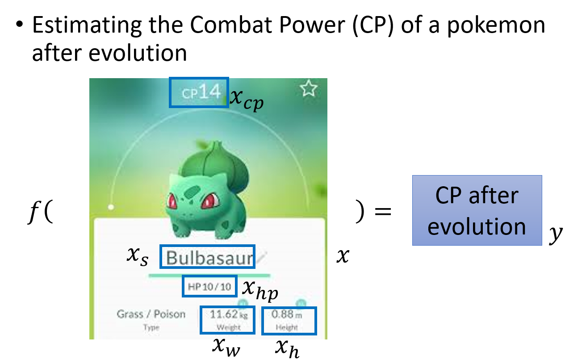

# Regression: Case study

## 问题导入: 预测Pokemon的CP值

根据已有的Pokemon进化前后的信息, 来预测某只Pokemon进化后的cp值大小

## 确定 Senario, Task, Model

### Senario

首先根据已有的data来确定Senario, 我们拥有宝可梦进化前后的cp值的这样一笔数据, input是进化前的Pokemon(包括他的各种属性), output是进化后的宝可梦的cp值; 因此我们的data是labeled, 使用的Senario是**Supervised Learning**

### Task

然后根据我们想要的function的输出类型来确定Task, 我们预期得到的是宝可梦进化后的cp值, 是一个scalar, 因此使用的task是**Regression**

### Model

关于Model, 选择很多, 这里采用**Non-linear Model**

## 设定具体参数

$X$: 表示一只Pokemon, 用下标表示改Pokemon的某种属性
$X_{cp}$: 表示改Pokemon进化前后的cp值
$X_S$: 表示该Pokemon是属于哪一种物种, 比如妙瓜种子, 皮卡丘
$X_{hp}$: 生命值
$X_w$: 表示体重
$X_h$: 高度
$f()$: 我们要找的function
$y$: function的output, 进化后的cp值, 是一个scalar

## Regression的具体过程

### machine learning 的三个步骤

- 定义一个model即function set
- 定义一个goodness of function 损失函数去评估function的好坏
- 找一个最好的function

### Step1: Model(function set)

> 如何选择一个线性模型呢?
> 一种种地试

Linear Model 线性模型
